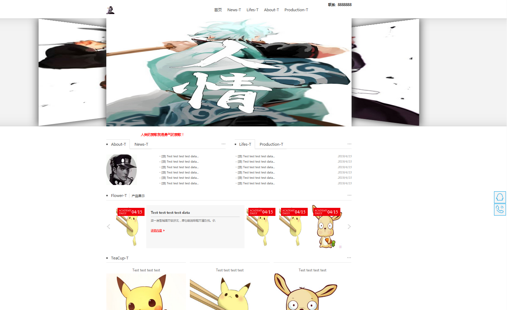
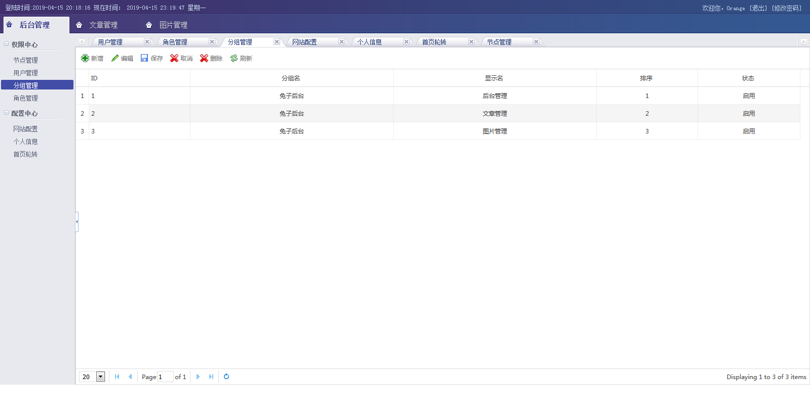
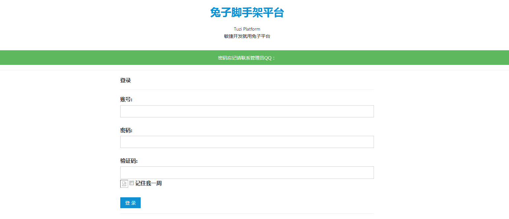

# Project： Orange

对照着beego上面示例网站写出来的一个网站(github.com/hunterhug/rabbit).

## 1. 介绍

1. 基本的登录(需要验证码), cookie记住登录功能
2. 权限认证功能(基于RBAC), 有友好的后台操作界面, 可以进行角色性的功能授权, 用户管理
3. 支持基本的文章(可置顶,指定排序), 富文本编辑, 有回收站功能. 相册功能, 可上传文件, 类似文章功能
4. 前端支持轮转图, 首页配置灵活, 可配置统计代码, 跟帖代码等
5. beego框架, maze UI v2.7.0（部分后台）和jQuery EasyUI v1.4.2（后台表格CRUD）、Bootstrap v3.3.5（前台）混合 sqlites3(以前是mysql)


## 2. How to Develop

### a. Project Structure(modularization)

```shell
    ----conf config module

        ----app.conf 		app config file
        ----local_**.ini 	internationalization file

    ----controllers   controllers module
        ----admin	  back-end
            ----blog  blog-edit(category/paper) module
            ----rbac  authority module
        ----home 	front end
        ----rbac.go router authority filtering

    -----lib  public Library
    -----file upload file keep in here
    
    -----models ORM module
        ----admin RBAC database operation
            ----AdminInit.go admin data fill by this
        ----blog  blog database operation

    ----routers url router
    ----static  static file such as css/js
        ---admin  back-end js/css
        ---home  front-end js/css
            ---amazi  Meizi UI(China)
            ---boostrap Most Niubi UI
         ---tool some tool js
         ---diy our diy js/css
    ----views	 template views
        ----admin 	back-end
            ----default defaule theme
        ----home 	front-end
            ----default default theme

    ----front can use for vue/angular... preparing
        ---data JSON data

    ---help  help yu init db
        --- init.sql important data
        --- ngnix-tuzi.conf Nginx config
```

### b. 详情

1. RBAC权限相关的models统一放在admin文件夹,其他都放在home文件夹.前台控制相关的controllers统一放在home文件夹,其他都放在admin文件夹.URL router统一M/C/A方式,该正则url需要验证权限如rbac/public/index（三个参数）,其他如public/index不验证.
2. 登录说明：登陆过的用户只能注销后登录，支持定义cookie登录.进入后台时验证session,session不存在则验证cookie.如果用户未被冻结,增加session,同时更改用户登录时间、登录IP等.cookie与登录IP绑定（防止cookie劫持）.
3. 系统时间默认数据库本地时间为东八区北京时间.
4. 后台模板在views/admin前台模板在views/home子文件夹为主题默认主题为default
5. 所有配置在conf文件夹conf/app.conf支持国际化 
6. 数据库数据填充在models/*/*Init.go中定义， 我准备将所有中文变成英文
7. 各种前端文件全部放在static中
8. 前台首页配置

```
{
	    "1":{"name":"About","limit":6},
        "2":{"name":"News","limit":6},
        "3":{"name":"Lifes","limit":6},
        "4":{"name":"Production","limit":6},
        "5":{"name":"Flower","limit":6},
        "6":{"name":"TeaCup","limit":6}
}
```

# Have a Look!








